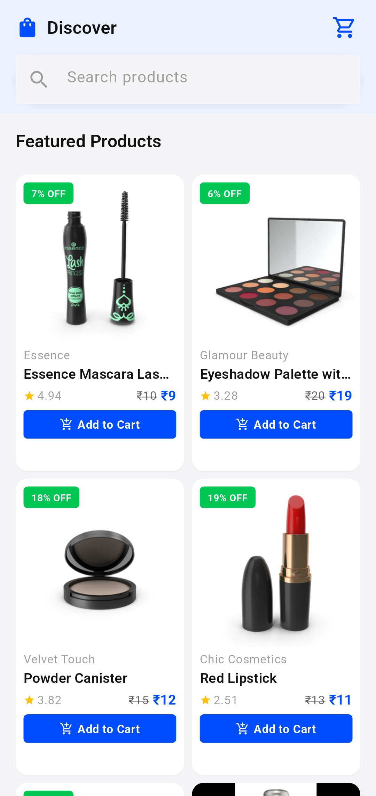
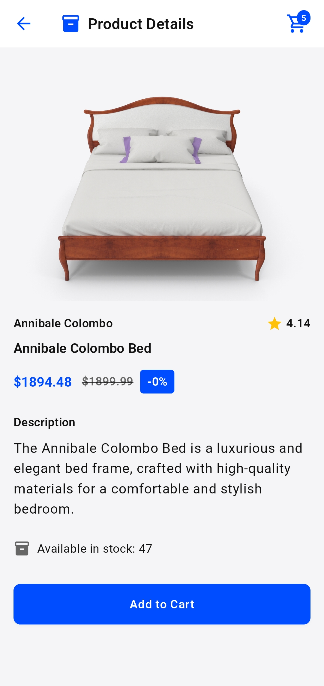
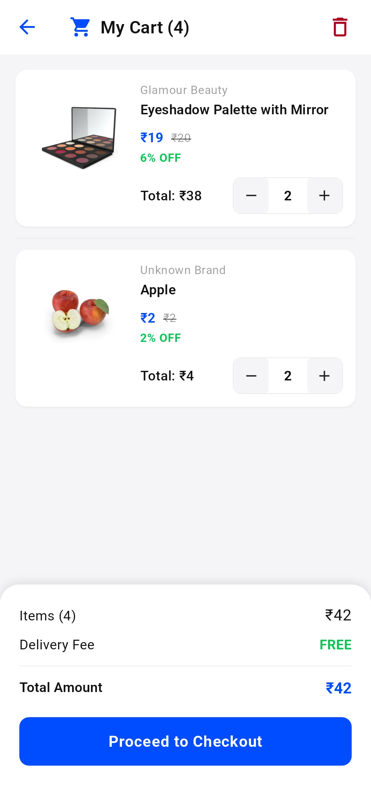
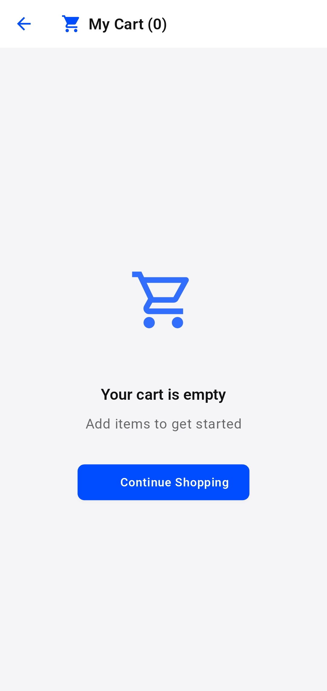

# ShopEase - Modern Flutter Shopping App


A modern shopping application built with Flutter that demonstrates clean architecture principles, responsive design, and state management using Riverpod. This app provides a user-friendly shopping experience with error handling and a modular codebase.

## 🎥 Demo Video

[](https://www.youtube.com/watch?v=PLACEHOLDER "ShopEase Demo")

*Coming soon: Click the image above to watch a demo of ShopEase in action*

## 📱 Screenshots

<div style="display: flex; flex-direction: row; flex-wrap: wrap; gap: 10px; justify-content: center;">
  
  
  
  
</div>

*Screenshots placeholder - Replace with actual app screenshots*

## ✨ Implemented Features

- **Product Catalogue** - Browse through products with efficient pagination
- **Detailed Product Pages** - View product details, specifications, and images
- **Shopping Cart** - Add, remove, and update quantities with real-time price calculations
- **Discount System** - Automatic discount calculations based on product pricing rules
- **Responsive UI Components** - Basic responsive design for different screen sizes
- **Error Handling** - Basic error handling with user-friendly messages
- **Null Safety** - Null-safe code with safe getters for API responses

## 🏗️ Architecture

The app follows a Clean Architecture approach with a clear separation of concerns:

```
lib/
  core/              # Core utilities, constants, and reusable components
    constants/       # App-wide constants
    theme/           # Theme configuration
    utils/           # Utility functions and classes
    widgets/         # Reusable UI components
  features/          # Feature modules
    catalogue/       # Product catalogue feature
      data/          # Data layer with API integration
      domain/        # Business logic & entities
      presentation/  # UI components & state management
    cart/            # Shopping cart feature
      data/
      domain/
      presentation/
  main.dart          # Application entry point
```

This architecture provides:
- **Maintainability** - Clear boundaries between components
- **Scalability** - Easy addition of new features without affecting existing code

## 🚀 Performance Features

Current optimizations in the app include:

- **Widget Structure** - Breaking down widgets into smaller, focused components
- **Const Constructors** - Strategic use of const constructors where applicable
- **Pagination** - Efficient product loading with pagination
- **Image Caching** - Using CachedNetworkImage for optimized image loading
- **Component Reusability** - Reusing common UI components across the app

## 🛠️ Technologies Used

- **State Management**: [Riverpod](https://riverpod.dev/) for state management
- **Navigation**: [GoRouter](https://pub.dev/packages/go_router) for declarative routing
- **Network & API**: [Dio](https://pub.dev/packages/dio) for API integration
- **Image Handling**: [CachedNetworkImage](https://pub.dev/packages/cached_network_image) for image loading and caching
- **Dependency Injection**: Provider pattern for simple dependency management
- **UI Framework**: Material Design components

## 🛡️ Error Handling

Current error handling implementation includes:

- **API Error Handling** - Basic handling of network errors
- **Null Safety** - Implementation of Dart's null safety features
- **Safe Getters** - Custom getters to safely access potentially null data
- **Error Widgets** - Basic error UI components with retry options

## 🚀 Getting Started

### Prerequisites

- Flutter SDK (3.0 or higher)
- Dart SDK (3.0 or higher)
- Android Studio / VS Code with Flutter extensions
- An emulator or physical device for testing

### Installation

1. Clone the repository
   ```bash
   git clone https://github.com/yourusername/shopease.git
   ```

2. Navigate to the project directory
   ```bash
   cd shopease
   ```

3. Install dependencies
   ```bash
   flutter pub get
   ```

4. Run code generation for API clients and data models
   ```bash
   flutter pub run build_runner build --delete-conflicting-outputs
   ```

5. Run the app
   ```bash
   flutter run
   ```

## 💡 Usage

- **Browse Products**: Scroll through the product catalogue
- **View Product Details**: Tap on a product to see detailed information and images
- **Add to Cart**: Add products to your shopping cart with a single tap
- **Manage Cart**: View your cart, update quantities, or remove items as needed
- **View Discounts**: See applied discounts and final prices

## 🔌 API Integration

The app integrates with the [DummyJSON](https://dummyjson.com/products) API, which provides:
- Product information and images
- Category data
- Price and discount information

## 📝 License

This project is licensed under the MIT License - see the LICENSE file for details.

## 🙏 Acknowledgments

- [Flutter Team](https://flutter.dev/) for the amazing cross-platform framework
- [DummyJSON](https://dummyjson.com/) for the API service used in this project
- All the open-source package maintainers whose work made this project possible

## 🚧 Planned Features & Improvements

These features are planned for future implementation:

- **Comprehensive Testing Suite** - Adding unit, widget and integration tests
- **Offline Support** - Adding local caching for offline functionality
- **Advanced Error Handling** - Implementing typed failures and structured error reporting
- **Enhanced Performance Optimizations** - Adding memoization and more strategic rebuilds
- **Improved JSON Serialization** - Adding more robust custom serialization
